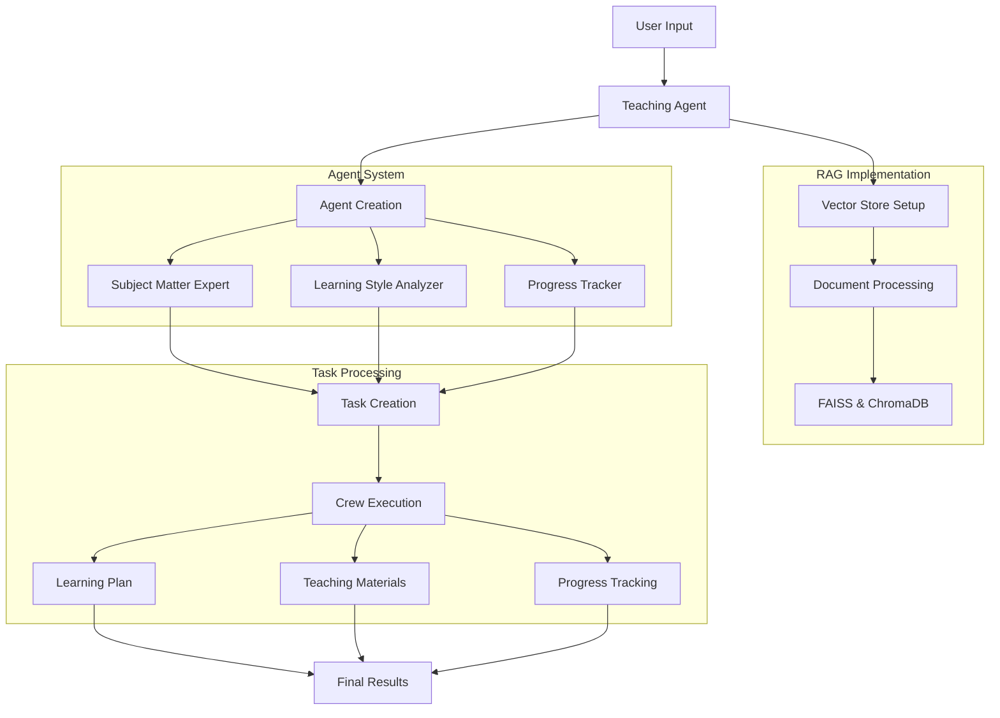

# Personalized Teaching Agent using CrewAI

This project implements a personalized teaching agent using CrewAI, which creates a crew of specialized AI agents to provide tailored learning experiences.

## Features

- Personalized learning based on student's learning style
- RAG (Retrieval Augmented Generation) implementation
- Vector database storage using FAISS and ChromaDB
- Multiple specialized teaching agents
- Progress tracking and feedback
- Environment variable configuration

## System Flow Diagram



## Setup

1. Clone the repository
2. Install dependencies:
   ```bash
   pip install -r requirements.txt
   ```
3. Create a `.env` file with the following variables:
   ```
   OPENAI_API_KEY=your_openai_api_key_here
   CHROMA_DB_DIRECTORY=./chroma_db
   MODEL_NAME=gpt-4-turbo-preview
   TEMPERATURE=0.7
   ```

## Usage

Run the teaching agent:
```bash
python teaching_agent.py
```

The program will prompt you for:
- Student name
- Topic to learn
- Learning style preference
- Prior knowledge
- Learning goals

## Architecture

The system consists of three main agents:
1. Subject Matter Expert - Provides comprehensive knowledge
2. Learning Style Analyzer - Adapts teaching methods
3. Progress Tracker - Monitors and evaluates progress

## Vector Database

The system uses FAISS for efficient similarity search and ChromaDB for persistent storage of embeddings.

## Guardrails

- Input validation for student information
- Error handling for API calls
- Secure environment variable management
- Rate limiting for API calls
